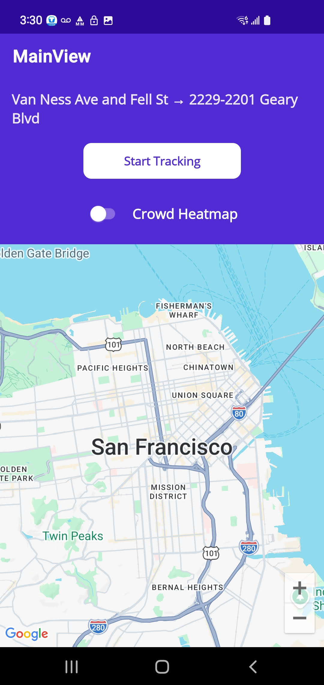
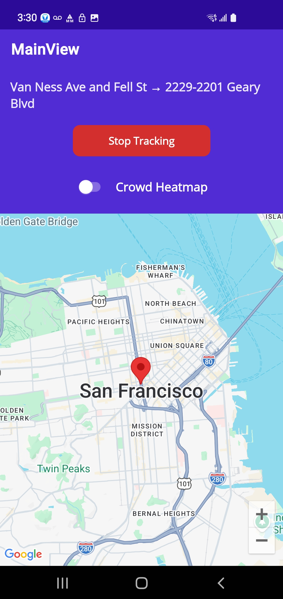
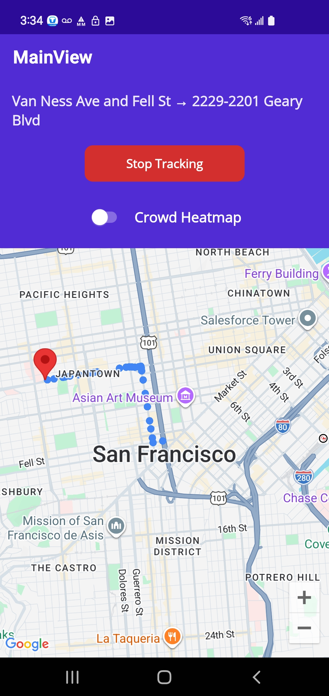
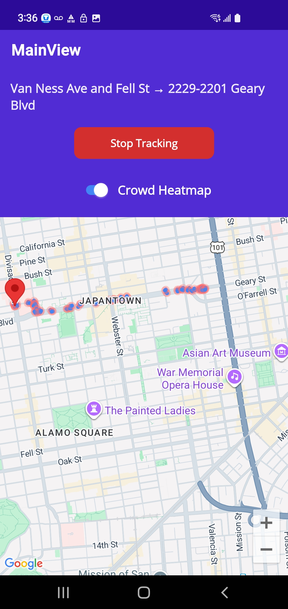
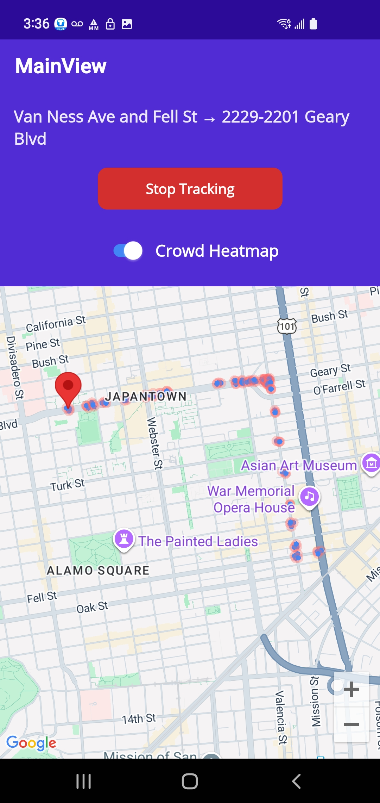

# Location Tracker - Multiplatform Mobile Application

**Course**: Software Engineering and Multiplatform App Development   (MSCS-533-A01) 
**Student**: Suresh Ghimire 
**Project**: Final Software Development Project  
**Framework**: .NET MAUI (Multi-platform App UI)  
**Platforms**: Android, iOS, Windows, macOS

---

## Project Overview

Location Tracker is a cross-platform mobile application built with .NET MAUI that enables real-time location tracking and visualization. The app simulates route navigation between predefined locations, tracks user movement, and provides advanced visualization features including crowd simulation heatmaps.

### Key Features

- **Real-time Location Tracking**: Simulates movement along routes fetched from Google Directions API
- **Interactive Map Visualization**: Displays current position and path history on Google Maps
- **Crowd Simulation Heatmap**: Toggle-able feature that simulates crowd density with synthetic location points
- **Persistent Data Storage**: SQLite database for storing tracking sessions and location history
- **Cross-platform Support**: Runs on Android, iOS, Windows, and macOS with shared codebase
- **MVVM Architecture**: Clean separation of concerns with Model-View-ViewModel pattern

---

## Architecture

### Technology Stack

- **Framework**: .NET MAUI (.NET 10)
- **Language**: C# 12
- **Database**: SQLite with SQLite-net-pcl
- **Maps**: Google Maps SDK (Android/iOS), Microsoft Maps (Windows)
- **API Integration**: Google Directions API
- **Design Pattern**: MVVM (Model-View-ViewModel)
- **Dependency Injection**: Built-in .NET DI Container

### Project Structure

```
LocationTrackerFinal/
├── Controls/              # Custom UI controls (HeatMapOverlay)
├── Converters/            # Value converters for data binding
├── Data/                  # Data access layer (Repository pattern)
├── Models/                # Domain models and DTOs
├── Services/              # Business logic and external services
│   ├── LocationTrackingService.cs
│   ├── HeatMapService.cs
│   ├── CrowdSimulator.cs
│   └── GoogleDirectionsService.cs
├── ViewModels/            # MVVM ViewModels
├── Views/                 # XAML views and pages
├── Platforms/             # Platform-specific implementations
│   ├── Android/
│   ├── iOS/
│   ├── Windows/
│   └── MacCatalyst/
└── Utilities/             # Helper classes and extensions
```

---

## Features in Detail

### 1. Location Tracking
- Fetches optimal routes from Google Directions API
- Simulates movement along the route with configurable intervals (default: 2 seconds)
- Persists location data to SQLite database
- Displays real-time position with red marker on map

### 2. Path Visualization
- Blue circular markers show historical path
- Smooth rendering of traveled route
- Automatic map updates as tracking progresses

### 3. Crowd Simulation Heatmap (NEW)
- **Toggle Feature**: Enable/disable crowd simulation via UI switch
- **Synthetic Point Generation**: Creates 2-4 random points around each tracked location
- **Visual Design**: 
  - Blue core circles (15m radius) representing individual positions
  - Light red outer layers (30m radius, 30% opacity) showing crowd density
- **Performance Optimized**: 
  - Limits to 30 most recent locations
  - Maximum 150 heatmap points
  - Periodic refresh (every 5 location updates)
- **Session-based**: Only shows heatmap for current tracking session

### 4. Data Persistence
- SQLite database stores:
  - Tracking sessions (start/end times, origin/destination)
  - Location points (latitude, longitude, timestamp)
- Repository pattern for clean data access
- Async operations for non-blocking UI

---

## 📸 Screenshots

### Main Interface

*Main tracking interface with map view and control buttons*

### Location Tracking

*Active tracking session showing path and current position*

### Crowd Heatmap - Toggle OFF

*Normal tracking mode with blue path dots*

### Crowd Heatmap - Toggle ON

*Crowd simulation enabled showing blue cores with red outer layers*

### Route Visualization

*Completed route with full path history*

---

## Setup and Installation

### Prerequisites

- Visual Studio 2022 (v17.8 or later) with .NET MAUI workload
- .NET 10 SDK
- Android SDK (for Android development)
- Xcode (for iOS development on macOS)
- Google Maps API Key

### Configuration

1. **Clone the repository**
   ```bash
   git clone https://github.com/sghimire2025/MCCS_533_Location_Tracker_Final    
   cd LocationTrackerFinal
   ```

2. **Configure API Keys**
   
   Update `appsettings.json` with your Google API credentials:
   ```json
   {
     "GoogleMaps": {
       "ApiKey": "YOUR_GOOGLE_MAPS_API_KEY"
     }
   }
   ```

3. **Platform-specific Setup**

   **Android**:
   - Add Google Maps API key to `Platforms/Android/AndroidManifest.xml`
   - Ensure location permissions are configured

   **iOS**:
   - Add Google Maps API key to `Platforms/iOS/Info.plist`
   - Configure location usage descriptions

4. **Build and Run**
   ```bash
   dotnet build
   dotnet run -f net10.0-android  # For Android
   dotnet run -f net10.0-ios      # For iOS
   ```

---

## Usage

### Starting a Tracking Session

1. Launch the application
2. (Optional) Toggle "Crowd Heatmap" switch ON to enable crowd simulation
3. Tap "Start Tracking" button
4. Watch as the app simulates movement from origin to destination
5. Observe the path visualization and heatmap (if enabled)

### Stopping Tracking

1. Tap "Stop Tracking" button
2. Session data is automatically saved to database
3. Map displays complete route history

### Viewing Heatmap

- **Toggle OFF**: Shows standard blue path dots
- **Toggle ON**: Shows crowd simulation with blue/red circles
- Heatmap updates every 5 location points for performance

---

## Performance Optimizations

### Crowd Simulation Performance (MVP)

To ensure smooth performance on mobile devices:

- **Limited Point Generation**: 2-4 points per location (down from 5-10)
- **Location Cap**: Maximum 30 recent locations processed
- **Point Limit**: Maximum 150 heatmap points rendered
- **Refresh Throttling**: Updates every 5 location changes (10 seconds)
- **Session-based**: Only current session data during active tracking

**Result**: ~90 heatmap points × 2 circles = ~180 total circles (lightweight rendering)

---

## Technical Implementation

### Key Services

#### LocationTrackingService
- Manages tracking lifecycle
- Integrates with Google Directions API
- Simulates movement along route
- Emits location update events

#### HeatMapService
- Generates heatmap data from location points
- Supports crowd simulation mode
- Implements grouping and intensity calculations
- Session-based and all-data queries

#### CrowdSimulator
- Generates synthetic location points
- Random distribution within radius
- Configurable density (2-4 points)
- Realistic coordinate calculations

### Platform Handlers

#### Android: HeatMapOverlayHandler
- Extends Google Maps MapHandler
- Renders circles for heatmap visualization
- Manages marker lifecycle
- Optimized circle rendering

#### iOS: HeatMapOverlayHandler
- Extends MapKit MKMapView
- Similar functionality to Android
- Platform-specific rendering

---

## Design Decisions

### Why MVVM?
- Clear separation of UI and business logic
- Testable ViewModels
- Data binding reduces boilerplate
- Industry standard for .NET applications

### Why SQLite?
- Lightweight and embedded
- No server required
- Cross-platform support
- Excellent for mobile apps

### Why Repository Pattern?
- Abstracts data access
- Easy to mock for testing
- Centralized data operations
- Future-proof for backend integration

### Why Crowd Simulation?
- Demonstrates advanced feature development
- Shows understanding of performance optimization
- Practical use case for heatmap visualization
- Differentiates from basic tracking apps

---

## Known Limitations (MVP)

1. **Hardcoded Route**: Origin and destination are predefined in code
2. **Simulated Movement**: Uses Google Directions route, not actual GPS
3. **Limited Heatmap**: Reduced points for performance (MVP optimization)
4. **No User Authentication**: Single-user application
5. **No Cloud Sync**: Data stored locally only

---

## 🔮 Future Enhancements

- [ ] User input for origin/destination addresses
- [ ] Real GPS tracking (not simulated)
- [ ] Multiple tracking sessions management
- [ ] Export tracking data (CSV, GPX)
- [ ] Cloud synchronization
- [ ] User authentication and profiles
- [ ] Configurable heatmap parameters
- [ ] Historical session playback
- [ ] Route optimization suggestions
- [ ] Battery optimization modes

---

## Learning Outcomes

This project demonstrates proficiency in:

-  Cross-platform mobile development with .NET MAUI
-  MVVM architectural pattern
-  Asynchronous programming (async/await)
-  RESTful API integration (Google Directions)
-  Local data persistence (SQLite)
-  Platform-specific implementations
-  Custom control development
-  Performance optimization
-  Error handling and logging
-  Dependency injection
-  Data binding and XAML
-  Map integration (Google Maps, MapKit)

---

## Development Notes

### Challenges Overcome

1. **Performance Issues**: Initial crowd simulation crashed app with 10,000+ circles
   - **Solution**: Implemented aggressive limits and periodic refresh

2. **Real-time Updates**: Heatmap refresh on every location update caused lag
   - **Solution**: Throttled to every 5 updates

3. **Cross-platform Rendering**: Different map APIs for Android/iOS
   - **Solution**: Platform-specific handlers with shared interface

4. **Data Binding**: Complex binding scenarios with collections
   - **Solution**: Used IEnumerable properties with explicit updates

---

## License

This project is developed as an academic assignment for MSCS-533-A01.

---